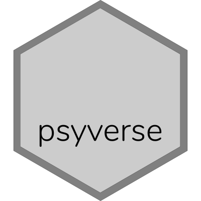

<!-- badges: start -->

[](https://gitlab.com/r-packages/psyverse/commits/master)
[](https://codecov.io/gl/r-packages/psyverse?branch=master)
[](https://cran.r-project.org/package=psyverse)
[](https://cran.r-project.org/package=psyverse)
[](https://cran.r-project.org/package=psyverse)
<!-- badges: end -->

#  psyverse 📦

psyverse: Decentralized Unequivocality in Psychological Science

The pkgdown website for this project is located at
<https://r-packages.gitlab.io/psyverse>.

<!--------------------------------------------->

<!-- Start of a custom bit for every package -->

<!--------------------------------------------->

In psychology, many different guidelines exist for developing
measurement instruments and manipulations of constructs. When conducting
empirical research or secondary research, therefore, it is important to
have a clear idea, and clearly communicate, which guidelines are
followed. However, these guidelines are fragmented, and no universal
consensus exists regarding how any construct must be measured or
manipulated. Therefore, developing one ‘final’ authoritative list or
taxonomy is not feasible or even desirable. At the same time, it is
important that people clearly communicate their ‘study-specific
taxonomy’. The `psyverse` package makes it possible to combine these
two goals.

For more background information on the concept underlying the
Decentralized Construct Taxonomies, see the reasoning set out in Peters
& Crutzen (2017a, 2017b) and Crutzen & Peters (2018). In brief, in those
papers the following premises are postulated:

  - Psychological constructs do not exist as such, but instead are
    useful metaphors that enable communication about, and measurement
    and manipulation of, aspects of the human psychology.
  - These constructs have verying degrees of specificity and levels of
    aggregation, and are therefore often represented in theories as
    influencing or causing one another.

From these premises it follows that is is not feasible (or desirable) to
develop one ‘final’ taxonomy of psychological constructs or of
manipulations of psychological constructs. Instead, multiple taxonomies
exist, each of which has different uses. For example, in behavior change
research, one taxonomy has been developed that is well-suited for
describing intervention content but that is not useful when developing
interventions (Abraham & Michie, 2008), and another that is well-suited
for developing interventions, but is in its present form less useful for
coding interventions (Kok et al., 2016).

Similarly, different theories that explain behavior postulate different
psychological variables as important predictors of behavior. These
variables generally overlap with each other: usually between theories,
but also within the same theory. For example, the main three
determinants in the Reasoned Action Approach are postulated to correlate
(Fishbein & Ajzen, 2010), correlations that are empirically almost
impossible to distinguish from structural composition (Peters & Crutzen,
2017a). Where different theories contain the same construct, they often
contain slightly different definitions and have different
operationalisational implications.

However, given that psychological constructs do not correspond to
natural kinds (Peters & Crutzen, 2017; also see e.g. Fried, 2017b),
there is no way to settle on ‘the best’ definitions or
operationalisations. Expert consensus is no sensible instrument, because
the opinions and preferences of experienced researchers reflect, to an
unknown degree, their training; and therefore, convictions from decades
ago (which does not necessarily make them wrong; but at the same time
does nothing to make it likely that they are right). Neither can this
problem be solved statistically. For example, correlation strengths also
reflect artefacts such as correlated measurement error that render the
assumption that correlation strengths can be used to infer ‘the best’
definitions or operationalisations circumspect (e.g. nonsense items
obtain equally high internal consistencies as items that appear sensible
at face value; Maul, 2017).

Perhaps then, it is no surprise that in practice, operationalisations
often vary between studies, with studies often using a wide array of
items, not to mention the variation in languages, target behaviors, and
cultures. For example, a recent review of self-identity
operationalisations identified hundreds of different items purportedly
measuring the same construct (Snippe, Peters & Kok, 2019). These
different measurement instruments purporting to measure the same
construct turn out to measure different things when this claim is tested
(see Fried, 2017 for depression; Weidman, Steckler & Tracy, 2017, for
emotions; Warnell & Redcay, 2019, for theory of mind; and Williams &
Rhodes, 2016a, for self-efficacy; a crowd-sourced list is available at
<https://docs.google.com/document/d/1vaq0U3_U2PEgouPLteUjab15aVxyEv2IVdbOxTErkHM>).
And when put to the test, many commonly used measurement instruments
turn out to be invalid in themselves (Hussey & Hughes, 2019). As a
consequence of this pluriformity and lack of validity, research
syntheses suffer, and in communication about research results, a lot is
lost in translation.

However, this variation observed in practice is hard to reconcile with
the need for consistency in communication. How can this be realised
given that there’s no scientifically justifiable way to identify ‘the
best’ definitions or operationalisations?

This is the problem Decentralized Construct Taxonomies (DCTs) aim to
solve.

<!--------------------------------------------->

<!--  End of a custom bit for every package  -->

<!--------------------------------------------->

## Installation

You can install the released version of `psyverse` from
[CRAN](https://CRAN.R-project.org) with:

``` r
install.packages('psyverse');
```

You can install the development version of `psyverse` from
[GitLab](https://gitlab.com) with:

``` r
devtools::install_gitlab('r-packages/psyverse');
```

(assuming you have `devtools` installed; otherwise, install that first
using the `install.packages` function)
