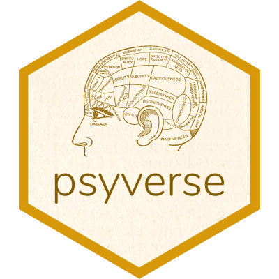

<!-- badges: start -->

[](https://gitlab.com/r-packages/psyverse/-/commits/main)
[](https://app.codecov.io/gl/r-packages/psyverse?branch=main)
[](https://cran.r-project.org/package=psyverse)
[](https://cran.r-project.org/package=psyverse)
[](https://cran.r-project.org/package=psyverse)
<!-- badges: end -->

#  psyverse 📦

psyverse: Decentralized Unequivocality in Psychological Science

The pkgdown website for this project is located at
<https://psyverse.one>.

<!--------------------------------------------->
<!-- Start of a custom bit for every package -->
<!--------------------------------------------->

## Preprint

There is a preprint discussing the background of this package in detail.
That preprint, “Knowing What We’re Talking About: Facilitating
Decentralized, Unequivocal Publication of and Reference to Psychological
Construct Definitions and Instructions” is available at
<https://psyarxiv.com/8tpcv/>.

<!--------------------------------------------->
<!--  End of a custom bit for every package  -->
<!--------------------------------------------->

## Installation

You can install the released version of `psyverse` from
[CRAN](https://CRAN.R-project.org) with:

``` r
install.packages('psyverse');
```

You can install the development version of `psyverse` from
[GitLab](https://about.gitlab.com/) with:

``` r
remotes::install_gitlab('r-packages/psyverse');
```

(assuming you have `remotes` installed; otherwise, install that first
using the `install.packages` function)
